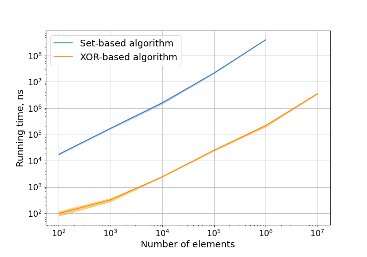

# Measuring running time of algorithms for finding unique missing element problem.


## Problem statement

I am interested in measuring running time for various algorithms to solve the following problem:

*Given an array of N-1 integers that contains all integers from 1 to N exactly once except for one, which is missing. Find this missing integer.*

Specifically, I am curious to know by what order running time of practical implementations of common solutions differ.

## Solutions
I am primarily focusing on two solutions:

1. Set-based, where elements from 1 to N are placed in the set and then pruned from it based on the input array.
2. XOR-base, which uses associative, commutative, self-inverse and zero-element-value-preservation properties to accumulate the values from range 1 to N in the single number and then prune from it based on the single array.

Much more detailed descriptions can be found on the Web and are given here just for reference.

I also acknowledge that there other solutions based on sum of arithmetic progressions but I decided to stick with the above ones as I remembered them myself.

## Running time

I implemented solutions in C++ and measured their running time using `std::chrono` functionality. The implementations themselves were not specifically optimized apart from common-sense implementations and `-O3` flag during compilation.

For each array size N I generated 100 arrays and measured running time on each of them on my own laptop. The times were then averaged.

The results for different values of array sizes are present in the table below. Running times are measured in nanoseconds.


|       | N=10^2 |N=10^3 |N=10^4 |N=10^5 |N=10^6 |N=10^7 |
| ----------- | ----------- | ----------- | ----------- | ----------- | ----------- | ----------- |
| Set-based     |   17520 ± 985.19     | 170348 ± 9393.33 | 1.58e+06 ± 143622 | 2.16e+07 ± 1.01e+06  |  3.99e+08 ± 2.63e+06 | -
| XOR-based   | 98 ± 19.8997  | 322 ± 46 | 2448 ± 67.0522 | 24831 ± 1541.86 | 214321 ± 20859 | 3.54e+06 ± 135647

And the same  results in the more visual format.



Unsurprisingly, XOR-based solution requires much less time to compute the answer. The difference is quite stark: more than two orders of magnitude.

If we look at the output of the compiler for the XOR-based solution in the [Compiler explorer]((https://godbolt.org/z/czdeqb)), we will see that SSE kicked in, the whole answer computation has been streamlined and executed on `xmm` registers.

Interestingly, when compiling with `-O0` flag, the result is kept on stack and, only starting with `-O1`, the computation is done in registers.   

So, overall, XOR-based solution is way more efficient and compiler is smart enough to exploit a modern processor architecture.

## Reproducing the results

The code for the main driver, which is doing all the bookkeeping and measuring, is located in the `main.cc` file.

Two solutions are located in header files `setbased.h` and `xorbased.h`. They implement the same function and exactly one of them is imported by the main driver.

To run the experiment choose the appropriate include in the main file, compile it and run a generated executable.  The binary expects an array size as a command-line argument and will produce a running time measurement over 100 runs.

So putting it together in the command-line:

```bash
# Change the solution #include in the main.cc
g++ --std=c++17 -O3 main.cc setbased.h xorbased.h -o missing
./missing NUMBER_OF_ELEMENTS
```
